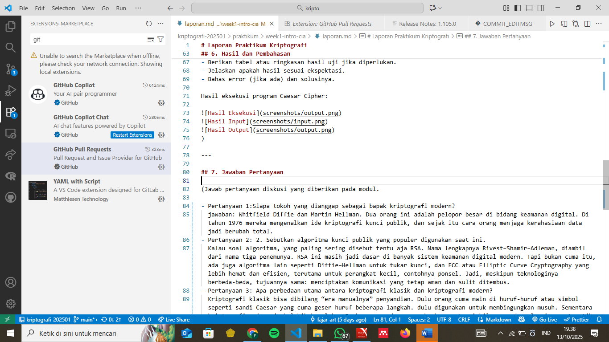

# Laporan Praktikum Kriptografi

Minggu ke-: 1  
Topik: Sejarah Kriptografi & Prinsip CIA
Nama: Fajar Saputro
NIM: 230202749
Kelas: 5IKRB

---

## 1. Tujuan

1.Menjelaskan sejarah dan evolusi kriptografi dari masa klasik hingga modern.
2.Menyebutkan prinsip Confidentiality, Integrity, Availability (CIA) dengan benar.
3.Menyimpulkan peran kriptografi dalam sistem keamanan informasi modern.
4.Menyiapkan repositori GitHub sebagai media kerja praktikum.

---

## 2. Dasar Teori

Kriptografi adalah ilmu tentang penyembunyian informasi atau menjaga kerahasiaan supaya cuma pihak berwenang yang dapat mengakses atau memahami pesan tersebut. Pada era kriptografi klasik, metode Caesar Cipher dan Vigenère Cipher sering digunakan untuk Merahasiakan pesan dengan teknik substitusi dan pergeseran huruf. Walaupun terlihat mudah, tapi konsep ini menjadi dasar dari sistem keamanan modern.

Perkembangan teknologi komputer mendorong lahirnya kriptografi modern, seperti algoritma RSA dan AES, yang mengandalkan operasi matematis kompleks dan penggunaan kunci digital untuk mengamankan komunikasi elektronik. RSA merupakan algoritma kunci publik yang berbasis pada kesulitan faktorisasi bilangan prima besar, sedangkan AES menggunakan sistem kunci simetris dengan transformasi blok untuk memastikan efisiensi dan keamanan tinggi.

Pada masa kini, kriptografi berkembang menuju era kontemporer, dengan penerapan pada teknologi blockchain dan cryptocurrency. Blockchain menggunakan fungsi hash kriptografis untuk memastikan integritas transaksi dan mencegah manipulasi data. Contohnya, Bitcoin memanfaatkan algoritma SHA-256 untuk menjaga keamanan rantai blok yang terdistribusi secara global.

---

## 3. Alat dan Bahan

(- Python 3.x

- Visual Studio Code / editor lain
- Git dan akun GitHub
- Library tambahan (misalnya pycryptodome, jika diperlukan) )

---

## 4. Langkah Percobaan

(Tuliskan langkah yang dilakukan sesuai instruksi.  
Contoh format:

1. Membuat file `caesar_cipher.py` di folder `praktikum/week2-cryptosystem/src/`.
2. Menyalin kode program dari panduan praktikum.
3. Menjalankan program dengan perintah `python caesar_cipher.py`.)

---

## 5. Source Code

(Salin kode program utama yang dibuat atau dimodifikasi.  
Gunakan blok kode:

```python
# contoh potongan kode
def encrypt(text, key):
    return ...
```

)

---

## 6. Hasil dan Pembahasan

Kriptografi
ilmu dan praktik mengamankan informasi dengan mengubahnya menjadi bentuk kode yang tidak dapat dibaca (enkripsi) dan mengembalikannya ke bentuk aslinya (dekripsi) menggunakan algoritma dan kunci tertentu, sehingga data dapat dilindungi dari akses tidak sah, dimanipulasi, atau disalahgunakan.

1.Era Kriptografi Klasik
dulu, kriptografi digunakan untuk komunikasi rahasia, khususnya dibidang militer dan diplomatik. Teknik seperti Caesar Cipher dan Vigenère Cipher yaitu mengganti atau menggeser huruf-huruf dopesan untuk membuat teks yang rahasia dan menggunakan kunci tertentu untuk dapat membaca pesannya. Walau terlihat mudah, metode ini adalaj awal dari sistem enkripsi yang lebih kompleks.

2.Perkembangan Kriptografi Modern
perkembangan teknologi digital membuat kriptografi semakin maju. adanya algoritma RSA dan AES menjadi era baru dalam keamanan informasi. RSA menggunaan pasangan kunci publik dan privat, sementara AES menjadi standar internasional untuk enkripsi data karena efisiensinya dan tingkat keamanan yang tinggi.

3.Evolusi Menuju Kriptografi Kontemporer
Pada era kontemporer, kriptografi menjadi fondasi utama berbagai sistem digital, termasuk blockchain dan cryptocurrency. Teknologi blockchain menggunakan fungsi hash dan tanda tangan digital untuk memastikan integritas data serta mencegah manipulasi tanpa otorisasi. Contohnya, Bitcoin menggunakan algoritma SHA-256 yang menjamin setiap blok data tidak dapat diubah tanpa mengubah keseluruhan jaringan.

Tiga Pilar Keamanan Informasi (CIA Triad)

1.Confidentiality (Kerahasiaan)
Confidentiality merupakan prinsip menjaga agar informasi hanya dapat diakses oleh pihak yang memiliki otorisasi. Tujuannya adalah mencegah kebocoran data kepada pihak yang tidak berwenang. Contoh penerapannya dapat dilihat pada sistem enkripsi end-to-end di aplikasi WhatsApp, di mana hanya pengirim dan penerima pesan yang dapat membaca isi pesan.

2.Integrity (Keutuhan Data)
Integrity berfokus pada pemeliharaan keaslian dan konsistensi data. Artinya, data tidak boleh diubah, dihapus, atau dimodifikasi tanpa izin. Contoh penerapannya adalah penggunaan digital signature dan checksum yang memastikan file atau pesan tidak mengalami perubahan selama proses pengiriman. Jika terdapat perbedaan hasil hash, maka integritas data dianggap telah terganggu.

3.Availability (Ketersediaan)
Availability menjamin agar sistem dan data dapat diakses kapan pun oleh pengguna yang berwenang. Prinsip ini penting untuk menjaga keberlangsungan layanan, terutama pada sistem yang bersifat kritikal. Misalnya, server perbankan menggunakan sistem backup dan redundancy agar tetap dapat beroperasi meskipun terjadi serangan siber atau gangguan teknis.

Ketiga pilar ini saling melengkapi dan tidak dapat dipisahkan dalam membangun sistem keamanan yang utuh. Tanpa Confidentiality, data dapat bocor; tanpa Integrity, data dapat dimanipulasi; dan tanpa Availability, data tidak dapat diakses oleh pengguna yang sah.
(- Lampirkan screenshot hasil eksekusi program (taruh di folder `screenshots/`).

- Berikan tabel atau ringkasan hasil uji jika diperlukan.
- Jelaskan apakah hasil sesuai ekspektasi.
- Bahas error (jika ada) dan solusinya.

Hasil eksekusi program Caesar Cipher:



)

---

## 7. Jawaban Pertanyaan

---

Pertanyaan 1: Siapa tokoh yang dianggap sebagai bapak kriptografi modern?

Tokoh yang dianggap sebagai bapak kriptografi modern adalah Whitfield Diffie dan Martin Hellman.
Pada tahun 1976, mereka memperkenalkan konsep revolusioner yaitu kriptografi kunci publik (public key cryptography) melalui publikasi ilmiah berjudul "New Directions in Cryptography".
Penemuan ini menjadi dasar bagi banyak algoritma keamanan digital modern, termasuk RSA, yang kemudian dikembangkan oleh Rivest, Shamir, dan Adleman pada tahun 1977.

Pertanyaan 2: Sebutkan algoritma kunci publik yang populer digunakan saat ini.

Beberapa algoritma kunci publik yang populer digunakan saat ini antara lain:
RSA (Rivest–Shamir–Adleman) → digunakan untuk enkripsi data dan pertukaran kunci.
ECC (Elliptic Curve Cryptography) → digunakan pada perangkat modern karena lebih efisien dan aman dengan ukuran kunci lebih kecil.
DSA (Digital Signature Algorithm) → digunakan untuk membuat dan memverifikasi tanda tangan digital.

Pertanyaan 3: Apa perbedaan utama antara kriptografi klasik dan kriptografi modern?
Perbedaan utama antara kriptografi klasik dan kriptografi modern terletak pada kompleksitas algoritma dan jenis kunci yang digunakan:

Kriptografi klasik menggunakan teknik sederhana seperti substitusi dan transposisi huruf, misalnya Caesar Cipher dan Vigenère Cipher. Sistem ini hanya cocok untuk teks dan mudah dipecahkan dengan analisis frekuensi.
Kriptografi modern menggunakan operasi matematis kompleks dan dapat diterapkan pada data digital dalam berbagai format. Contohnya, AES (Advanced Encryption Standard) untuk enkripsi simetris, dan RSA atau ECC untuk sistem kunci publik. Kriptografi modern jauh lebih aman karena berbasis teori matematika dan komputasi yang
sulit dipecahkan secara brute force.

---

## 8. Kesimpulan

Dari praktikum ini dapat disimpulkan bahwa kriptografi mengalami evolusi besar dari metode sederhana seperti Caesar Cipher menjadi sistem keamanan digital canggih seperti RSA, AES, dan blockchain. Selain itu, tiga pilar utama keamanan informasi — Confidentiality, Integrity, dan Availability — berperan penting dalam menjaga keamanan, keaslian, serta aksesibilitas data pada era digital modern.

## Dari praktikum ini dapat disimpulkan bahwa kriptografi mengalami kemajuan besar mulai dari metode sederhana (Caesar Cipher) menjadi sistem keamanan digital canggih seperti RSA, AES, dan blockchain. Selain itu, tiga pilar utama keamanan informasi — Confidentiality, Integrity, dan Availability — berperan penting dalam menjaga keamanan, keaslian, serta aksesibilitas data pada era digital modern.

## 9. Daftar Pustaka

(Cantumkan referensi yang digunakan.  
Contoh:

- Katz, J., & Lindell, Y. _Introduction to Modern Cryptography_.
- Stallings, W. _Cryptography and Network Security_. )

---

## 10. Commit Log

(Tuliskan bukti commit Git yang relevan.  
Contoh:

```
commit abc12345
Author: Nama Mahasiswa <email>
Date:   2025-09-20

    week1-intro-cia )
```
