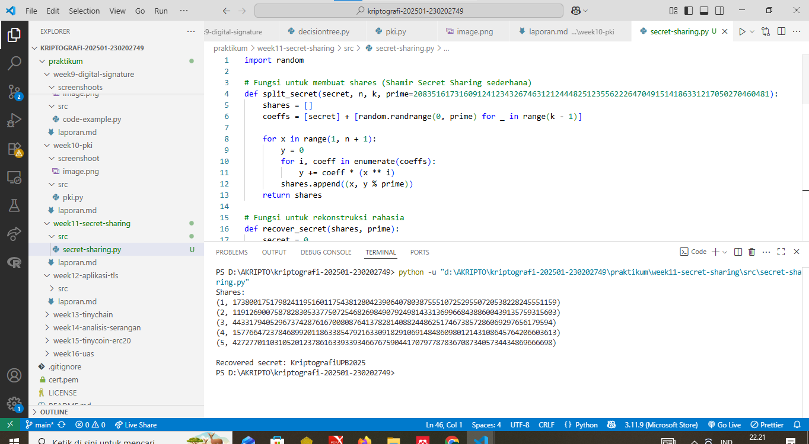

# Laporan Praktikum Kriptografi

Minggu ke-: 11
Topik: [secret-sharing]  
Nama: [Fajar Saputro]  
NIM: [230202749]  
Kelas: [5IKRB]

---

## 1. Tujuan

Setelah mengikuti praktikum ini, mahasiswa diharapkan mampu:

1. Menjelaskan konsep **Shamir Secret Sharing** (SSS).
2. Melakukan simulasi pembagian rahasia ke beberapa pihak menggunakan skema SSS.
3. Menganalisis keamanan skema distribusi rahasia.

---

## 2. Dasar Teori

Secret Sharing Scheme (SSS) merupakan metode kriptografi yang digunakan untuk membagi sebuah informasi rahasia menjadi beberapa bagian yang disebut share. Setiap share dibagikan kepada pihak yang berbeda sehingga tidak ada satu pihak pun yang mengetahui rahasia secara utuh. Salah satu skema Secret Sharing yang paling terkenal adalah Shamir’s Secret Sharing, yang diperkenalkan oleh Adi Shamir pada tahun 1979. Skema ini menggunakan prinsip matematika polinomial dan interpolasi Lagrange untuk menjaga keamanan rahasia.

Dalam Shamir’s Secret Sharing, rahasia dibagi menggunakan skema (k, n), di mana n adalah jumlah total share yang dihasilkan dan k adalah ambang batas minimum share yang dibutuhkan untuk merekonstruksi kembali rahasia. Rahasia disimpan sebagai konstanta pada sebuah polinomial berderajat (k−1), kemudian nilai polinomial tersebut dihitung pada beberapa titik berbeda untuk menghasilkan share. Setiap share sendiri tidak memberikan informasi apa pun tentang rahasia asli jika jumlahnya kurang dari k.

Keamanan skema ini terletak pada fakta bahwa untuk membangun kembali polinomial diperlukan minimal k titik. Selama jumlah share yang diperoleh kurang dari k, maka rahasia tidak dapat dihitung secara matematis. Oleh karena itu, meskipun sebagian share bocor, rahasia tetap aman. Konsep ini membuat Shamir’s Secret Sharing sangat cocok digunakan untuk melindungi data penting seperti kunci kriptografi dan informasi sensitif lainnya.

---

## 3. Alat dan Bahan

(- Python 3.x

- Visual Studio Code / editor lain
- Git dan akun GitHub

---

## 4. Langkah Percobaan

(Tuliskan langkah yang dilakukan sesuai instruksi.  
Contoh format:

1. Membuat file `caesar_cipher.py` di folder `praktikum/week11-secret-sharing/src/`.
2. Menyalin kode program dari panduan praktikum.
3. Menjalankan program dengan perintah `python caesar_cipher.py`.)

---

## 5. Source Code

(Salin kode program utama yang dibuat atau dimodifikasi.  
Gunakan blok kode:

```python
import random

# Fungsi untuk membuat shares (Shamir Secret Sharing sederhana)
def split_secret(secret, n, k, prime=208351617316091241234326746312124448251235562226470491514186331217050270460481):
    shares = []
    coeffs = [secret] + [random.randrange(0, prime) for _ in range(k - 1)]

    for x in range(1, n + 1):
        y = 0
        for i, coeff in enumerate(coeffs):
            y += coeff * (x ** i)
        shares.append((x, y % prime))
    return shares

# Fungsi untuk rekonstruksi rahasia
def recover_secret(shares, prime):
    secret = 0
    for j, (xj, yj) in enumerate(shares):
        num, den = 1, 1
        for m, (xm, _) in enumerate(shares):
            if m != j:
                num *= -xm
                den *= (xj - xm)
        secret += yj * num * pow(den, -1, prime)
    return secret % prime


# ================= MAIN PROGRAM =================

secret_text = "KriptografiUPB2025"
secret_int = int.from_bytes(secret_text.encode(), "big")

n = 5
k = 3
prime = 208351617316091241234326746312124448251235562226470491514186331217050270460481

shares = split_secret(secret_int, n, k, prime)
print("Shares:")
for s in shares:
    print(s)

recovered_int = recover_secret(shares[:3], prime)
recovered_text = recovered_int.to_bytes((recovered_int.bit_length() + 7) // 8, "big").decode()

print("\nRecovered secret:", recovered_text)

```

)

---

## 6. Hasil dan Pembahasan

(- Lampirkan screenshot hasil eksekusi program (taruh di folder `screenshots/`).

- Berikan tabel atau ringkasan hasil uji jika diperlukan.
- Jelaskan apakah hasil sesuai ekspektasi.
- Bahas error (jika ada) dan solusinya.

Hasil eksekusi program Caesar Cipher:


)

---

## 7. Jawaban Pertanyaan

(Jawab pertanyaan diskusi yang diberikan pada modul.  
-Mengapa skema (k, n) aman meskipun sebagian share bocor?:
Skema Secret Sharing dengan model (k, n) tetap aman karena satu atau beberapa share saja tidak cukup untuk mengetahui isi rahasia. Setiap share hanyalah potongan informasi yang secara matematis tidak bermakna jika berdiri sendiri. Rahasia baru bisa direkonstruksi ketika jumlah share yang dikumpulkan mencapai minimal k buah. Selama jumlah share yang bocor masih kurang dari k, penyerang tidak dapat menebak atau menghitung rahasia asli, sehingga keamanan data tetap terjaga.

-Apa risiko jika threshold k terlalu kecil atau terlalu besar?:
Jika nilai threshold k terlalu kecil, maka tingkat keamanannya menjadi lebih rendah karena rahasia bisa direkonstruksi dengan sedikit share saja, sehingga risiko penyalahgunaan meningkat jika share bocor. Sebaliknya, jika nilai k terlalu besar atau mendekati jumlah total share n, maka sistem menjadi kurang fleksibel. Risiko yang muncul adalah rahasia tidak dapat dipulihkan jika beberapa share hilang atau pemilik share tidak tersedia, sehingga bisa menyebabkan kehilangan data secara permanen.

-Bagaimana penerapan SSS di dunia nyata (contoh: manajemen kunci cryptocurrency, recovery password)?:
Secret Sharing Scheme banyak digunakan di dunia nyata untuk mengamankan data penting. Dalam manajemen kunci cryptocurrency, private key sering dibagi menjadi beberapa share dan disimpan di lokasi atau oleh orang yang berbeda, sehingga tidak ada satu pihak pun yang memegang kunci secara utuh. Pada sistem recovery password atau akses akun penting, SSS memungkinkan pemulihan akses dengan menggabungkan beberapa otorisasi, misalnya dari admin atau perangkat yang berbeda. Dengan cara ini, keamanan meningkat sekaligus tetap memberikan mekanisme pemulihan yang aman.
)

---

## 8. Kesimpulan

Shamir’s Secret Sharing merupakan teknik kriptografi yang efektif untuk melindungi informasi rahasia dengan cara membaginya menjadi beberapa share. Dengan menggunakan skema (k, n), sistem tetap aman meskipun sebagian share bocor, selama jumlah share yang dikumpulkan belum mencapai ambang batas k. Pemilihan nilai k yang tepat menjadi hal penting karena nilai yang terlalu kecil dapat menurunkan tingkat keamanan, sedangkan nilai yang terlalu besar dapat menyulitkan proses pemulihan rahasia.

Secara keseluruhan, Secret Sharing Scheme banyak diterapkan dalam dunia nyata, seperti pada manajemen kunci cryptocurrency, pengamanan sistem penting, dan mekanisme pemulihan akses. Melalui praktikum ini, dapat dipahami bahwa Secret Sharing tidak hanya meningkatkan keamanan data, tetapi juga memberikan solusi yang fleksibel dan aman dalam pengelolaan informasi rahasia. )

---

## 9. Daftar Pustaka

(Cantumkan referensi yang digunakan.  
Contoh:

- Katz, J., & Lindell, Y. _Introduction to Modern Cryptography_.
- Stallings, W. _Cryptography and Network Security_. )

---

## 10. Commit Log

```
commit week11-secretsharing
Author: Fajar Saputro <fajarsaputro82@gmail.com>
Date:   2025-09-20

    week11-secretsharing: implementasi secret sharing dan laporan )
```
