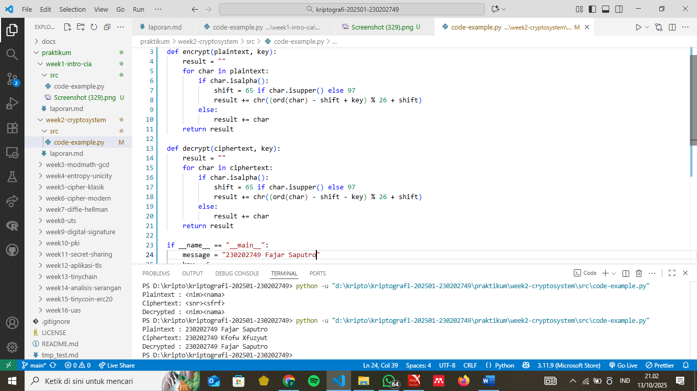
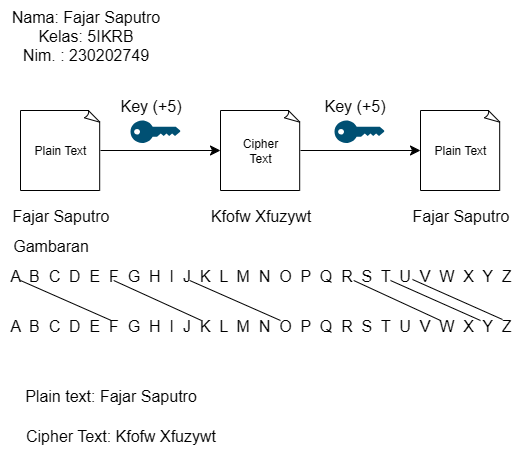

# Laporan Praktikum Kriptografi

Minggu ke-: X  
Topik: [judul praktikum]  
Nama: Fajar Saputro
NIM: 230202749  
Kelas: 5IKRB

---

## 1. Tujuan

1.Mengidentifikasi komponen dasar kriptosistem (plaintext, ciphertext, kunci, algoritma).
2.Menggambarkan proses enkripsi dan dekripsi sederhana.
3.Mengklasifikasikan jenis kriptosistem (simetris dan asimetris).

---

## 2. Dasar Teori

Kriptografi adalah ilmu dan seni yang berguna untuk menjaga keamanan informasi dengan mengubah data asli (plaintext) menjadi bentuk yang tidak dapat dibaca oleh sembarang orang (ciphertext) menggunakan sebuah algoritma dan kunci atau pola tertentu. Tujuannya adalah menjaga kerahasiaan, keaslian, dan integritas data dalam proses komunikasi digital.

dalam kriptosistem ada empat elemen utama, yaitu plaintext, ciphertext, kunci, dan algoritma. Plaintext yaitu pesan aslinya, ciphertext adalah hasil enkripsi, kunci (key) sebagai parameter proses enkripsi dan dekripsi, sedangkan algoritma merupakan rumus atau metode yang digunakan untuk melakukan kedua proses tersebut.

Dalam praktiknya, kriptografi terbagi menjadi dua jenis utama: kriptosistem simetris dan kriptosistem asimetris. Pada sistem simetris, kunci yang digunakan untuk enkripsi dan dekripsi adalah sama, contohnya AES atau DES. Sedangkan pada sistem asimetris, digunakan dua kunci berbeda (publik dan privat) seperti pada algoritma RSA atau ECC.

## 3. Alat dan Bahan

(- Python 3.x

- Visual Studio Code / editor lain
- Git dan akun GitHub
- Library tambahan (misalnya pycryptodome, jika diperlukan) )

---

## 4. Langkah Percobaan

(Tuliskan langkah yang dilakukan sesuai instruksi.  
Contoh format:

1. Membuat file `caesar_cipher.py` di folder `praktikum/week2-cryptosystem/src/`.
2. Menyalin kode program dari panduan praktikum.
3. Menjalankan program dengan perintah `python caesar_cipher.py`.)

---

## 5. Source Code

---

```python
# file: praktikum/week2-cryptosystem/src/simple_crypto.py

def encrypt(plaintext, key):
    result = ""
    for char in plaintext:
        if char.isalpha():
            shift = 65 if char.isupper() else 97
            result += chr((ord(char) - shift + key) % 26 + shift)
        else:
            result += char
    return result

def decrypt(ciphertext, key):
    result = ""
    for char in ciphertext:
        if char.isalpha():
            shift = 65 if char.isupper() else 97
            result += chr((ord(char) - shift - key) % 26 + shift)
        else:
            result += char
    return result

if __name__ == "__main__":
    message = "230202749 Fajar Saputro"
    key = 5

    enc = encrypt(message, key)
    dec = decrypt(enc, key)

    print("Plaintext :", message)
    print("Ciphertext:", enc)
    print("Decrypted :", dec)
```

---

## 6. Hasil dan Pembahasan

---

Hasil eksekusi program Caesar Cipher:
Proses Encrypt: Pesan berhasil ter enkripsi.yang awalnya "Fajar Saputro" diubah menjadi ciphertext dengan algoritma +5 atau geser lima angka setelahnya sebagai key atau kuncinya menjadi "Kfofw Xfuzywt"
Proses Decrypt:
Pesan berhasil ter deskripsi.yang awallnya ciphertext "Kfofw Xfuzywt" diubah menjadi plaintext dengan algoritma +5 atau geser lima angka setelahnya sebagai key atau kuncinya menjadi "Fajar Saputro"

Lampiran



---

## 7. Jawaban Pertanyaan

Pertanyaan 1: Siapa tokoh yang dianggap sebagai bapak kriptografi modern?
Tokoh yang dianggap sebagai bapak kriptografi modern adalah Whitfield Diffie dan Martin Hellman. Pada tahun 1976, mereka memperkenalkan konsep revolusioner bernama kriptografi kunci publik (public key cryptography) melalui publikasi berjudul “New Directions in Cryptography.”
Penemuan ini menjadi dasar bagi banyak sistem keamanan digital masa kini, termasuk algoritma RSA yang dikembangkan oleh Rivest, Shamir, dan Adleman pada tahun 1977.

Pertanyaan 2: Sebutkan algoritma kunci publik yang populer digunakan saat ini.
Beberapa algoritma kunci publik yang populer dan banyak digunakan saat ini antara lain:
RSA (Rivest–Shamir–Adleman): digunakan untuk enkripsi data dan pertukaran kunci secara aman.
ECC (Elliptic Curve Cryptography): banyak digunakan pada perangkat modern karena memberikan keamanan tinggi dengan ukuran kunci yang lebih kecil.
DSA (Digital Signature Algorithm): digunakan untuk membuat dan memverifikasi tanda tangan digital agar data tidak dapat dipalsukan.

Pertanyaan 3: Apa perbedaan utama antara kriptografi klasik dan kriptografi modern?
Perbedaan mendasar antara kriptografi klasik dan modern terletak pada kompleksitas algoritma serta penggunaan jenis kunci.
Kriptografi klasik menggunakan teknik sederhana seperti substitusi dan transposisi huruf, contohnya Caesar Cipher dan Vigenère Cipher, yang mudah dipecahkan dengan analisis frekuensi.
Sedangkan kriptografi modern menerapkan konsep matematika dan teori komputasi yang kompleks, serta dapat digunakan untuk melindungi berbagai jenis data digital. Contohnya, AES (Advanced Encryption Standard) untuk enkripsi simetris, dan RSA atau ECC untuk sistem kunci publik. Sistem modern jauh lebih aman karena sulit ditembus oleh brute force maupun analisis statistik.

---

## 8. Kesimpulan

Berdasarkan hasil percobaan, dapat disimpulkan bahwa proses enkripsi dan dekripsi bekerja dengan baik sesuai teori. Kriptosistem terdiri dari empat elemen penting, yaitu plaintext, ciphertext, kunci, dan algoritma.
Selain itu, sistem kriptografi dapat diklasifikasikan menjadi dua jenis utama — simetris (menggunakan satu kunci) dan asimetris (menggunakan dua kunci berbeda). Percobaan ini memperlihatkan bagaimana konsep dasar keamanan informasi diterapkan secara praktis dalam pemrograman.

---

## 9. Daftar Pustaka

(Cantumkan referensi yang digunakan.  
Contoh:

- Katz, J., & Lindell, Y. _Introduction to Modern Cryptography_.
- Stallings, W. _Cryptography and Network Security_. )

---

## 10. Commit Log

(Tuliskan bukti commit Git yang relevan.  
Contoh:

```
commit abc12345
Author: Nama Mahasiswa <email>
Date:   2025-09-20

    week2-cryptosystem: implementasi Caesar Cipher dan laporan )
```
