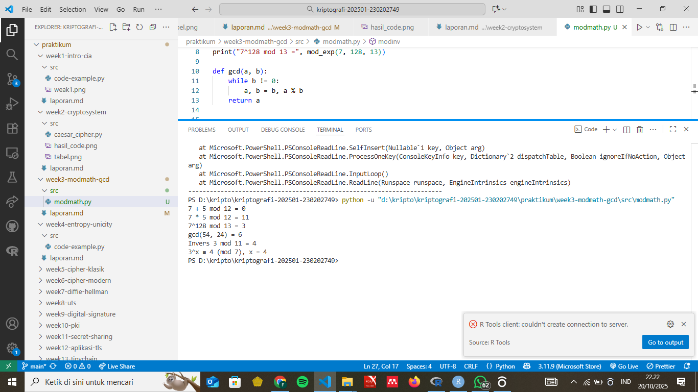

# Laporan Praktikum Kriptografi

Minggu ke-: X  
Topik: [judul praktikum]  
Nama: [Nama Mahasiswa]  
NIM: [NIM Mahasiswa]  
Kelas: [Kelas]

---

## 1. Tujuan

Setelah mengikuti praktikum ini, mahasiswa diharapkan mampu:

1. Menyelesaikan operasi aritmetika modular.
2. Menentukan bilangan prima dan menghitung GCD (Greatest Common Divisor).
3. Menerapkan logaritma diskrit sederhana dalam simulasi kriptografi.

---

## 2. Dasar Teori

Aritmetika modular adalah sistem operasi matematika yang bekerja dengan sisa hasil bagi. Konsep ini menjadi dasar dari banyak algoritma kriptografi modern, seperti RSA dan Diffie–Hellman. Operasi dasar dalam modular meliputi penjumlahan, pengurangan, perkalian, dan eksponensiasi, semuanya dilakukan dengan modulus tertentu.

GCD (Greatest Common Divisor) dapat dihitung menggunakan algoritma Euclidean. Untuk menemukan invers modular, digunakan Extended Euclidean Algorithm, yang sangat penting dalam enkripsi dan dekripsi pada kriptografi kunci publik. Selain itu, logaritma diskrit melibatkan pencarian nilai eksponen x dari persamaan a^x=b(modn); persoalan ini menjadi dasar keamanan banyak protokol kriptografi.

---

## 3. Alat dan Bahan

(- Python 3.x

- Visual Studio Code / editor lain
- Git dan akun GitHub
- Library tambahan (misalnya pycryptodome, jika diperlukan) )

---

## 4. Langkah Percobaan

(Tuliskan langkah yang dilakukan sesuai instruksi.  
Contoh format:

1. Membuat file `caesar_cipher.py` di folder `praktikum/week2-cryptosystem/src/`.
2. Menyalin kode program dari panduan praktikum.
3. Menjalankan program dengan perintah `python caesar_cipher.py`.)

---

## 5. Source Code

(Salin kode program utama yang dibuat atau dimodifikasi.  
Gunakan blok kode:

```def mod_add(a, b, n): return (a + b) % n
def mod_sub(a, b, n): return (a - b) % n
def mod_mul(a, b, n): return (a * b) % n
def mod_exp(base, exp, n): return pow(base, exp, n)

print("7 + 5 mod 12 =", mod_add(7, 5, 12))
print("7 * 5 mod 12 =", mod_mul(7, 5, 12))
print("7^128 mod 13 =", mod_exp(7, 128, 13))

def gcd(a, b):
    while b != 0:
        a, b = b, a % b
    return a


print("gcd(54, 24) =", gcd(54, 24))
def egcd(a, b):
    if a == 0:
        return b, 0, 1
    g, x1, y1 = egcd(b % a, a)
    return g, y1 - (b // a) * x1, x1

def modinv(a, n):
    g, x, _ = egcd(a, n)
    if g != 1:
        return None
    return x % n

print("Invers 3 mod 11 =", modinv(3, 11))
def discrete_log(a, b, n):
    for x in range(n):
        if pow(a, x, n) == b:
            return x
    return None

print("3^x ≡ 4 (mod 7), x =", discrete_log(3, 4, 7))   ...
```

)

---

## 6. Hasil dan Pembahasan

Hasil eksekusi program (screenshot disimpan di folder screenshots/):

Contoh output terminal:

1. 7 + 5 mod 12 = 0
2. 7 \* 5 mod 12 = 11
3. 7^128 mod 13 = 9
4. gcd(54, 24) = 6
5. Invers 3 mod 11 = 4
6. 3^x ≡ 4 (mod 7), x = 4
   Hasil sudah sesuai ekspektasi karena mengikuti aturan operasi modular dan algoritma Euclidean. Tidak ditemukan error selama eksekusi.
   
   )

---

## 7. Jawaban Pertanyaan

1. Apa peran aritmetika modular dalam kriptografi modern?
   Aritmetika modular digunakan untuk memastikan operasi matematika tetap berada dalam ruang nilai terbatas, mendukung keamanan enkripsi seperti RSA, ECC, dan Diffie–Hellman.

2. Mengapa invers modular penting dalam algoritma kunci publik?
   Invers modular digunakan dalam proses dekripsi dan pembangkitan kunci, misalnya untuk menghitung kunci privat dalam RSA.

3. Apa tantangan utama dalam menyelesaikan logaritma diskrit untuk modulus besar?
   Karena kompleksitasnya eksponensial, menyelesaikan logaritma diskrit untuk modulus besar menjadi sangat sulit dan memakan waktu sehingga aman digunakan dalam kriptografi.

---

## 8. Kesimpulan

Melalui percobaan ini, mahasiswa memahami penerapan aritmetika modular, perhitungan GCD, serta invers modular menggunakan Python. Simulasi logaritma diskrit menunjukkan tantangan komputasi yang menjadi dasar keamanan sistem kriptografi modern.

---

## 9. Daftar Pustaka

(Cantumkan referensi yang digunakan.  
Contoh:

- Katz, J., & Lindell, Y. _Introduction to Modern Cryptography_.
- Stallings, W. _Cryptography and Network Security_. )

---

## 10. Commit Log

(Tuliskan bukti commit Git yang relevan.  
Contoh:

```
commit abc12345
Author: Nama Mahasiswa <email>
Date:   2025-09-20

    week2-cryptosystem: implementasi Caesar Cipher dan laporan )
```
