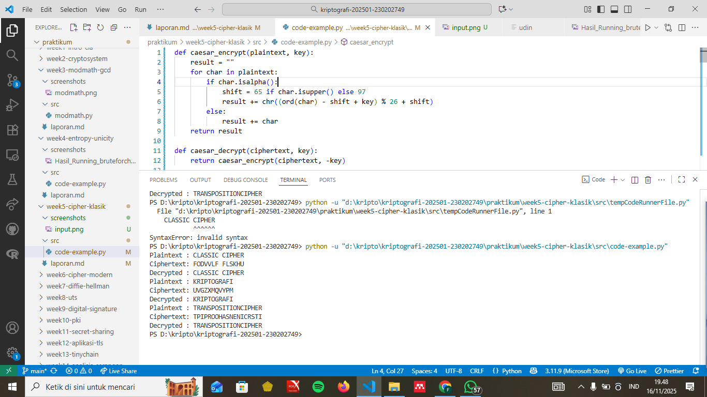
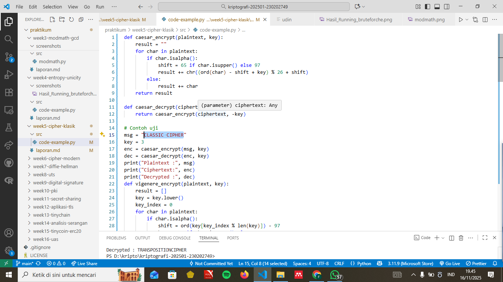

# Laporan Praktikum Kriptografi

Minggu ke-: X  
Topik: [Cipher Klasik]  
Nama: [Fajar Saputro]  
NIM: [230202749]  
Kelas: [5 IKR B]

---

## 1. Tujuan

1. Menerapkan algoritma Caesar Cipher untuk enkripsi dan dekripsi teks.
2. Menerapkan algoritma Vigenère Cipher dengan variasi kunci.
3. Mengimplementasikan algoritma transposisi sederhana.
4. Menjelaskan kelemahan algoritma kriptografi klasik

---

## 2. Dasar Teori

(Ringkas teori relevan (cukup 2–3 paragraf).  
Contoh: definisi cipher klasik, konsep modular aritmetika, dll. )

---

## 3. Alat dan Bahan

(- Python 3.x

- Visual Studio Code / editor lain
- Git dan akun GitHub
- Library tambahan (misalnya pycryptodome, jika diperlukan) )

---

## 4. Langkah Percobaan

(Tuliskan langkah yang dilakukan sesuai instruksi.  
Contoh format:

1. Membuat file `caesar_cipher.py` di folder `praktikum/week2-cryptosystem/src/`.
2. Menyalin kode program dari panduan praktikum.
3. Menjalankan program dengan perintah `python caesar_cipher.py`.)

---

## 5. Source Code

(Salin kode program utama yang dibuat atau dimodifikasi.  
Gunakan blok kode:

```python
def caesar_encrypt(plaintext, key):
    result = ""
    for char in plaintext:
        if char.isalpha():
            shift = 65 if char.isupper() else 97
            result += chr((ord(char) - shift + key) % 26 + shift)
        else:
            result += char
    return result

def caesar_decrypt(ciphertext, key):
    return caesar_encrypt(ciphertext, -key)

# Contoh uji
msg = "CLASSIC CIPHER"
key = 3
enc = caesar_encrypt(msg, key)
dec = caesar_decrypt(enc, key)
print("Plaintext :", msg)
print("Ciphertext:", enc)
print("Decrypted :", dec)
def vigenere_encrypt(plaintext, key):
    result = []
    key = key.lower()
    key_index = 0
    for char in plaintext:
        if char.isalpha():
            shift = ord(key[key_index % len(key)]) - 97
            base = 65 if char.isupper() else 97
            result.append(chr((ord(char) - base + shift) % 26 + base))
            key_index += 1
        else:
            result.append(char)
    return "".join(result)

def vigenere_decrypt(ciphertext, key):
    result = []
    key = key.lower()
    key_index = 0
    for char in ciphertext:
        if char.isalpha():
            shift = ord(key[key_index % len(key)]) - 97
            base = 65 if char.isupper() else 97
            result.append(chr((ord(char) - base - shift) % 26 + base))
            key_index += 1
        else:
            result.append(char)
    return "".join(result)

# Contoh uji
msg = "KRIPTOGRAFI"
key = "KEY"
enc = vigenere_encrypt(msg, key)
dec = vigenere_decrypt(enc, key)
print("Plaintext :", msg)
print("Ciphertext:", enc)
print("Decrypted :", dec)
def transpose_encrypt(plaintext, key=5):
    ciphertext = [''] * key
    for col in range(key):
        pointer = col
        while pointer < len(plaintext):
            ciphertext[col] += plaintext[pointer]
            pointer += key
    return ''.join(ciphertext)

def transpose_decrypt(ciphertext, key=5):
    num_of_cols = int(len(ciphertext) / key + 0.9999)
    num_of_rows = key
    num_of_shaded_boxes = (num_of_cols * num_of_rows) - len(ciphertext)
    plaintext = [''] * num_of_cols
    col = 0
    row = 0
    for symbol in ciphertext:
        plaintext[col] += symbol
        col += 1
        if (col == num_of_cols) or (col == num_of_cols - 1 and row >= num_of_rows - num_of_shaded_boxes):
            col = 0
            row += 1
    return ''.join(plaintext)

# Contoh uji
msg = "TRANSPOSITIONCIPHER"
enc = transpose_encrypt(msg, key=5)
dec = transpose_decrypt(enc, key=5)
print("Plaintext :", msg)
print("Ciphertext:", enc)
print("Decrypted :", dec)...
```

)

---

## 6. Hasil dan Pembahasan

(program berjalan dengan lancar (taruh di folder `screenshots/`).

Hasil eksekusi program Caesar Cipher:




)

---

## 7. Jawaban Pertanyaan

(Jawab pertanyaan diskusi yang diberikan pada modul.

- Pertanyaan 1: Kelemahan utama Caesar Cipher dan Vigenère Cipher

Caesar Cipher memiliki kelemahan utama karena ruang kuncinya sangat kecil. Jumlah pergeseran huruf hanya sekitar 26 kemungkinan, sehingga bisa dengan mudah di-brute-force. Selain itu, cipher ini tidak mengubah pola frekuensi huruf, sehingga analisis frekuensi dapat dengan cepat membuka plaintext.

Vigenère Cipher sebenarnya lebih kuat, tetapi tetap lemah jika panjang kuncinya pendek atau berulang. Kunci yang berulang menyebabkan ciphertext dapat dipisahkan menjadi beberapa bagian yang sebenarnya hanya cipher Caesar. Inilah yang memudahkan serangan seperti Kasiski dan Friedman untuk menebak panjang kunci lalu memecahkannya dengan analisis frekuensi.

Kesimpulannya: keduanya tidak mampu menyembunyikan statistik bahasa dengan baik.

- Pertanyaan 2: Mengapa cipher klasik mudah diserang dengan analisis frekuensi?

Karena cipher klasik tidak menghilangkan pola statistik huruf pada bahasa alami. Dalam bahasa seperti Indonesia atau Inggris, ada huruf yang sering muncul (misalnya E, A, N, T), ada pula pola karakter seperti “AN” atau “ER” yang sering berulang.

Walaupun hurufnya berubah atau posisinya ditukar, distribusi frekuensi huruf tetap hampir sama. Penyerang cukup menghitung huruf yang paling sering muncul dalam ciphertext lalu memetakannya ke huruf yang paling sering muncul pada bahasa asli — akhirnya plaintext bisa diungkap.

- Pertanyaan 3: Cipher substitusi mengganti huruf asli menjadi huruf lain. Keunggulannya mudah diterapkan dan memberi efek penyamaran langsung pada karakter. Namun kelemahan utamanya adalah pola frekuensi huruf tidak berubah, sehingga sangat rentan terhadap analisis frekuensi.

Cipher transposisi tidak mengubah hurufnya, tetapi hanya memindahkan urutan huruf. Keunggulannya, struktur teks menjadi lebih acak, dan pemecahan membutuhkan analisis pola posisi, bukan hanya frekuensi huruf. Namun karena frekuensi huruf juga tidak berubah, cipher ini tetap bisa dipecahkan oleh kriptanalisis yang lebih mendalam.

Dalam praktek modern, cipher yang kuat harus menggabungkan kedua konsep: menyamarkan hubungan antara plaintext dan ciphertext (confusion) serta menyebarkan perubahan kecil ke seluruh ciphertext (diffusion). Cipher klasik tidak mampu melakukan keduanya sekaligus dengan kuat.  
)

---

## 8. Kesimpulan

Pada praktikum ini telah berhasil diimplementasikan tiga algoritma kriptografi klasik yaitu Caesar Cipher, Vigenère Cipher, dan Transposition Cipher untuk proses enkripsi dan dekripsi teks. Dari hasil percobaan, seluruh program dapat berjalan dengan baik dan mampu menghasilkan ciphertext serta plaintext sesuai teori dasar masing-masing algoritma.

Caesar Cipher menunjukkan proses enkripsi berbasis pergeseran huruf menggunakan aritmetika modular, sedangkan Vigenère Cipher menerapkan kunci yang lebih bervariasi untuk meningkatkan kompleksitas enkripsi. Sementara itu, algoritma transposisi membuktikan bahwa keamanan dapat ditingkatkan bukan hanya dengan mengubah karakter tetapi juga melalui penataan ulang posisi teks.

Namun demikian, percobaan ini juga menegaskan bahwa algoritma kriptografi klasik memiliki kelemahan fundamental. Distribusi frekuensi huruf pada ciphertext masih mempertahankan pola bahasa asli, sehingga teknik kriptanalisis seperti analisis frekuensi masih dapat digunakan untuk memecahkan cipher ini. Oleh karena itu, cipher klasik saat ini tidak lagi dianggap aman dan hanya digunakan sebagai dasar pemahaman menuju algoritma modern yang menggabungkan confusion dan diffusion secara lebih kuat.

---

## 9. Daftar Pustaka

(Cantumkan referensi yang digunakan.  
Contoh:

- Katz, J., & Lindell, Y. _Introduction to Modern Cryptography_.
- Stallings, W. _Cryptography and Network Security_. )

---

## 10. Commit Log

(Tuliskan bukti commit Git yang relevan.  
Contoh:

```
commit abc12345
Author: fajarsaputro82@gmmail.com <email>
Date:   2025-09-20

    week2-cryptosystem: implementasi Caesar Cipher dan laporan )
```
